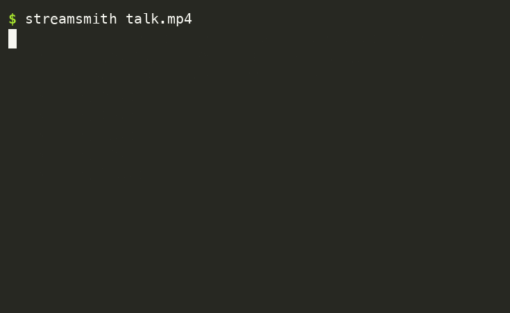
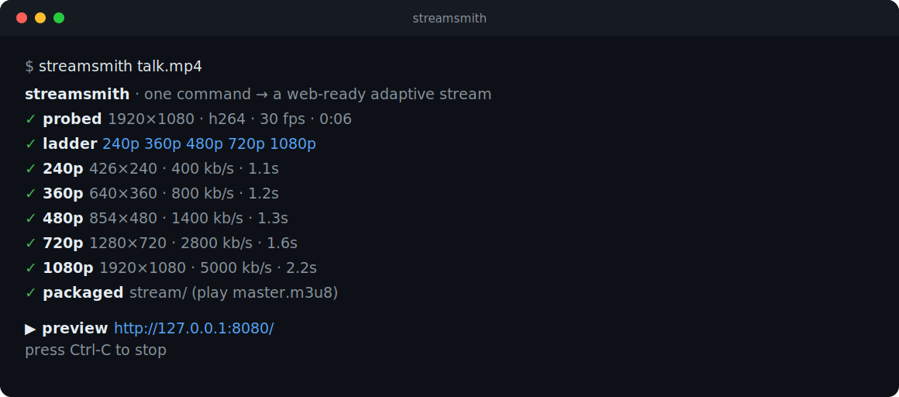

<div align="center">

# streamsmith

**Turn any video into a ready-to-serve HLS adaptive-bitrate stream — with a built-in preview player — in one command.**

[](https://crates.io/crates/streamsmith)
[](https://github.com/Amahdip/streamsmith/actions/workflows/ci.yml)
[](#license)

<!--
  Hero image. The static SVG below renders instantly on GitHub.
  For an animated version, run `vhs demo.tape` (see demo.tape) to produce
  docs/demo.gif, then change the line below to: 
-->


</div>

---

Getting a video onto the web *properly* — multiple quality levels, adaptive
switching, segmented, with a master playlist — normally means wrangling a wall
of FFmpeg flags you copy-paste and don't fully trust. **streamsmith does it in
one command**, then opens a player so you can watch it adapt in real time.

```text
streamsmith · one command → a web-ready adaptive stream
✓ probed  1920×1080 · h264 · 30 fps · 0:06
✓ ladder  240p  360p  480p  720p  1080p
✓   240p   426×240 · 400 kb/s · 1.1s
✓   360p   640×360 · 800 kb/s · 1.2s
✓   480p   854×480 · 1400 kb/s · 1.3s
✓   720p   1280×720 · 2800 kb/s · 1.6s
✓   1080p  1920×1080 · 5000 kb/s · 2.2s
✓ packaged  stream/  (play master.m3u8)

  ▶ preview  http://127.0.0.1:8080/
  press Ctrl-C to stop
```

## Why

<table>
<tr><th>Before — raw FFmpeg</th><th>After — streamsmith</th></tr>
<tr><td>

```bash
ffmpeg -i talk.mp4 \
 -filter_complex "[0:v]split=3[v1][v2][v3];\
 [v1]scale=w=1920:h=1080[v1o];\
 [v2]scale=w=1280:h=720[v2o];\
 [v3]scale=w=854:h=480[v3o]" \
 -map "[v1o]" -c:v:0 libx264 -b:v:0 5000k \
 -map "[v2o]" -c:v:1 libx264 -b:v:1 2800k \
 -map "[v3o]" -c:v:2 libx264 -b:v:2 1400k \
 -map a:0 -map a:0 -map a:0 -c:a aac -b:a 128k \
 -f hls -hls_time 6 -hls_playlist_type vod \
 -master_pl_name master.m3u8 \
 -var_stream_map "v:0,a:0 v:1,a:1 v:2,a:2" \
 stream/%v.m3u8
# ...and hope the resolutions, bandwidths,
# and keyframes line up. Then find a player.
```

</td><td>

```bash
streamsmith talk.mp4
```

That's it. streamsmith probes the source, builds a
sensible ladder (never upscaling), keyframe-aligns
every segment so players switch cleanly, writes a
correct master playlist, and serves a preview you
can actually watch.

</td></tr>
</table>

## Install

```bash
# From crates.io (needs a Rust toolchain)
cargo install streamsmith

# Or grab a prebuilt binary from the Releases page:
#   https://github.com/Amahdip/streamsmith/releases
```

**Requirement:** [FFmpeg](https://ffmpeg.org/download.html) (`ffmpeg` and
`ffprobe`) on your `PATH`. That's the only runtime dependency.

## Usage

```bash
# The whole point: package + preview in one go.
streamsmith talk.mp4

# Package into a specific folder, don't launch a server.
streamsmith talk.mp4 --out ./dist --no-serve

# Tune it.
streamsmith talk.mp4 --segment 4 --preset slow --jobs 4 --port 9000

# Offload encoding to the GPU / media engine (Apple VideoToolbox, NVIDIA
# NVENC, Intel QuickSync). `auto` picks whatever your ffmpeg build has.
streamsmith talk.mp4 --hwaccel auto
```

<details>
<summary><b>All options</b></summary>

```
Usage: streamsmith [OPTIONS] <INPUT>

Arguments:
  <INPUT>              Input video (a file path, or any URL your ffmpeg can read)

Options:
  -o, --out <OUT>      Output directory for the bundle          [default: stream]
      --segment <N>    HLS segment length, in seconds           [default: 6]
      --preset <P>     x264 preset (ultrafast … placebo)        [default: veryfast]
      --hwaccel <H>    off | auto | videotoolbox | nvenc | qsv  [default: off]
  -j, --jobs <N>       Max parallel encodes                     [default: CPU count]
      --no-serve       Package only; don't start the preview
      --port <PORT>    Preview server port                      [default: 8080]
      --no-open        Don't open a browser automatically
      --ffmpeg <PATH>  Path to the ffmpeg binary                [default: ffmpeg]
      --ffprobe <PATH> Path to the ffprobe binary               [default: ffprobe]
  -h, --help           Print help
  -V, --version        Print version
```

</details>

The output directory is a complete, static HLS bundle — drop it behind any web
server (nginx, S3 + CloudFront, GitHub Pages, Caddy) and it just streams. Point
your `<video>` at `master.m3u8` via [hls.js](https://github.com/video-dev/hls.js)
(or natively in Safari).

### Hardware encoding

`--hwaccel auto` offloads encoding to your GPU / media engine, auto-detecting
VideoToolbox (Apple), NVENC (NVIDIA), or QuickSync (Intel). The default stays
`libx264` on purpose: on a capable multi-core machine it gives the best
quality-per-bitrate and is often just as fast. Reach for `--hwaccel` when the
**CPU is the constraint** (a NAS, a small VPS, an SBC) or you want to keep the
CPU free and the machine cool — not as a guaranteed speedup. Measure on your
own hardware and content.

## How it works

```text
 input ──► ffprobe ──► ABR ladder ──► ffmpeg ×N (parallel) ──► HLS bundle ──► preview
           metadata    (no upscale)   one process / rung       + master.m3u8   (hls.js)
```

1. **Probe** the source with `ffprobe` (resolution, fps, codec, audio).
2. **Plan** an adaptive-bitrate ladder from the source — every standard tier at
   or below the source height, widths kept to the source aspect ratio.
3. **Encode** each rung with its own `ffmpeg` process, run with bounded
   parallelism so the CPU is saturated but never oversubscribed. Segments are
   keyframe-aligned to the segment length so clients switch quality cleanly.
4. **Write** a correct `master.m3u8` with real `BANDWIDTH`/`RESOLUTION` tags.
5. **Serve** a zero-config preview player pointed at the stream.

## vs. the alternatives

| | streamsmith | raw FFmpeg | [HlsKit](https://crates.io/crates/hlskit) | [vsd](https://crates.io/crates/vsd) |
|---|:---:|:---:|:---:|:---:|
| One-command CLI | ✅ | ⚠️ (a scary one) | ❌ (a library) | ✅ |
| Plans the ladder for you | ✅ | ❌ | ⚠️ | — |
| Built-in preview player | ✅ | ❌ | ❌ | ❌ |
| Purpose | **package for delivery** | anything | embed in Rust apps | **download** streams |

## Roadmap

- [x] Hardware-accelerated encoders (VideoToolbox / NVENC / QSV) via `--hwaccel`
- [ ] MPEG-DASH output alongside HLS (`--dash`)
- [ ] Poster/thumbnail + sprite-sheet (`WEBVTT`) generation
- [ ] `fMP4`/CMAF segments (shared HLS + DASH media)
- [ ] Watch-a-folder / batch mode

Contributions to any of these are very welcome — see below.

## Contributing

Issues and PRs are welcome! See [CONTRIBUTING.md](CONTRIBUTING.md). Good first
issues are tagged on the tracker.

## License

Licensed under either of [MIT](LICENSE-MIT) or [Apache-2.0](LICENSE-APACHE) at
your option.
